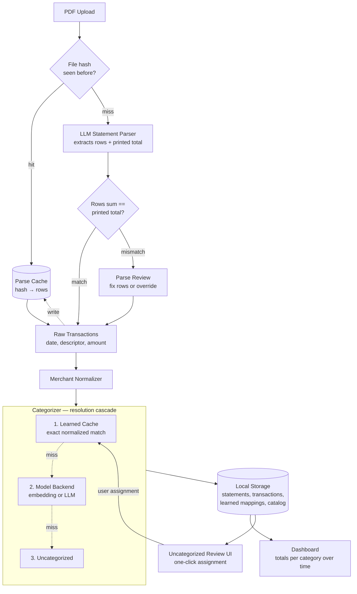

# Architecture

Stack-neutral component view of the credit-card category tool. No language, framework,
or library names appear here — those are deferred to a follow-up design. The goal of
this document is a shared mental model of the components and the seams between them.

## Component diagram

## Components

- **PDF Upload** — entry point for one or more statement PDFs. Records the source file
  and hands bytes to the hashing step.
- **File Hash** — content hash of the uploaded PDF. Used as the parse-cache key so the
  same file re-imported is free and reproducible.
- **Parse Cache** — `hash → extracted rows + printed total`. On a hit, the LLM parser is
  skipped entirely; on a miss, results are written here after reconciliation passes.
  Makes re-imports offline and deterministic.
- **LLM Statement Parser** — single implementation of the `StatementParser` interface.
  Sends statement text to a model and asks for a strict schema:
  `{rows: [{date, descriptor, amount}], printed_total: <number>}`. Knows nothing about
  specific banks — relies on the model to handle layout differences.
- **Reconciliation** — sums the extracted rows and compares against the parser's
  `printed_total` (within a small tolerance, e.g. one cent). Gates acceptance: only
  reconciled parses flow downstream. Turns the LLM's silent-failure mode (dropped row,
  hallucinated row, merged rows) into a loud, gated one.
- **Parse Review** — surfaces mismatched parses to the user with rows + claimed total +
  delta. User can fix rows manually or accept as-is (e.g., if the printed total includes
  fees the user wants categorized separately). Manual fixes write back to the parse
  cache so the same statement doesn't re-trigger the LLM.
- **Merchant Normalizer** — single source of truth for cleaning descriptor strings
  (strip store numbers, city/state, common POS prefixes, casing). Used by both the
  learned cache and fuzzy match — divergence would silently break categorization.
- **Categorizer (resolution cascade)** — one `Categorizer` interface,
  `string -> category`. Three layers; first hit wins:
  1. Learned cache — exact normalized merchant → category. Highest priority so manual
     corrections always win and any given merchant is classified at most once.
  2. Model backend — embedding similarity or LLM classification. Invoked only for
     cache misses; the cache bounds how often this runs.
  3. Uncategorized — surfaced to the review UI for one-click assignment.

  Rule-based and fuzzy-match layers were considered and intentionally left out.
  Rules are belt-and-suspenders that the cache + model combination subsumes after one
  round of user corrections. Fuzzy match is a degenerate form of embedding similarity
  (string distance vs semantic distance) and is redundant when a model backend is
  present. Either can be added later if a concrete need surfaces.
- **Local Storage** — persists statements, transactions (with resolved category), the
  learned merchant→category mapping, the parse cache, and the canonical category
  catalog.
- **Dashboard** — totals per category over time, drill-down to transactions.
- **Uncategorized Review UI** — one-click categorization for unknown merchants. Each
  assignment writes back to the learned cache, so the same merchant resolves
  automatically next time. **This feedback loop is the core UX.**

## Seams (pluggable interfaces)

These are the boundaries that must stay clean so backends can be swapped without
touching unrelated code:

1. **`StatementParser`** — `pdf bytes -> {rows, printed_total}`. One implementation
   initially (LLM-based). A deterministic per-bank implementation can be added later
   without rewiring anything else.
2. **`Categorizer`** — the overall `string -> category` boundary.
3. **Model backend** — the single swap point inside the categorizer. Embedding-based
   (compare a merchant vector against learned-cache vectors) and LLM-based (classify
   from the descriptor string) are both valid implementations and interchangeable
   without touching the cache, the normalizer, or the UI.
4. **Category catalog** — a single canonical list referenced everywhere; never hardcode
   category strings inline.

## Invariants

- **No parse enters the system without passing reconciliation or explicit user
  override.** This is the safety property that makes LLM-based parsing acceptable for
  financial data.
- **Each PDF is parsed by the LLM at most once.** The parse cache keyed by file hash
  makes re-imports free, offline, and deterministic.
- **Cache writes (learned categorizer cache) only happen at user assignment time.**
  Model-driven classifications do not poison the cache without explicit user
  confirmation.
- **Each distinct merchant is classified by a model at most once.** The learned cache
  makes the categorizer model-backend choice low-stakes — cost-bounded,
  offline-replayable.
- **MCC codes are not assumed.** They aren't on printed statements; categorization
  works from descriptor strings only.

## Honest tradeoffs of this design

- **Parsing requires an LLM-capable backend on first import.** Cache hits and everything
  post-parse (dashboard, recategorization, review) remain fully offline. The
  `StatementParser` seam exists specifically so a deterministic fallback can be added
  if and when this matters.
- **Per-statement LLM cost is trivial for personal use** (statements are short; pennies
  per year at expected volume). If volume changes, the cache bounds it.
- **The reconciliation gate is load-bearing.** If a statement doesn't print a usable
  total, reconciliation degrades to a weaker check (e.g., row-count sanity) or the
  statement goes straight to parse review. The system should never silently accept an
  unreconciled parse.

## Deferred decisions

The following are intentionally out of scope here and will be addressed in follow-up
design docs:

- Language / runtime / framework choice
- PDF text extraction library (the LLM still needs page text; *how* that's pulled from
  the PDF is a stack decision)
- Specific model / provider for the LLM parser
- Database choice and schema
- Folder structure
- Test strategy
- Deployment / packaging
