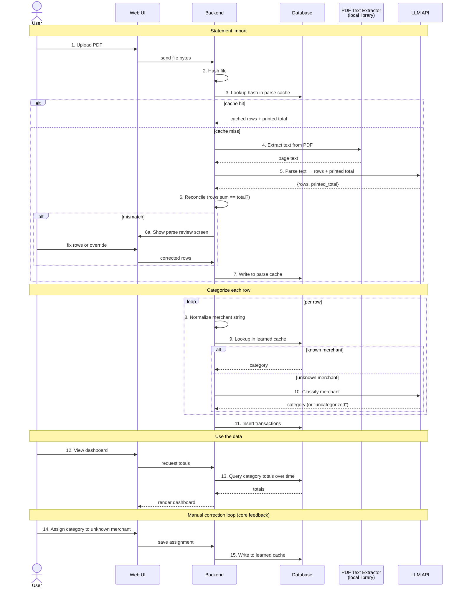

# Process Flow

End-to-end sequence for importing a statement, categorizing transactions, viewing the
dashboard, and the manual-correction feedback loop. Complements `ARCHITECTURE.md` —
that file describes *what exists*; this one describes *what happens, in what order,
and which system handles each step*.

## Sequence

## Participants

The five systems shown across the top of the diagram:

- **Web UI** — the browser-side interface for upload, dashboard, parse review, and the
  uncategorized-merchant review queue.
- **Backend** — the local app's server-side logic. Owns hashing, reconciliation,
  merchant normalization, and orchestration between the other systems.
- **Database** — local persistent store. Holds statements, transactions, the parse
  cache (`hash → rows`), the learned merchant→category mapping, and the canonical
  category catalog.
- **PDF Text Extractor** — a *local* library (e.g., `pdfplumber`, `pymupdf`). Runs
  in-process; deterministic; free; offline. The LLM never sees the binary PDF — only
  the text this step produces.
- **LLM API** — remote model used for two distinct jobs: (a) parsing extracted text
  into structured rows + printed total, and (b) classifying unknown merchants. Both
  are bounded by caches above them, so each PDF is parsed at most once and each
  distinct merchant is classified at most once.

## Notable branches

- **Parse-cache hit (steps 4–7 skipped).** Re-importing the same PDF returns instantly,
  offline, and free. The user can drag the same file in twice without polluting totals.
- **Reconciliation mismatch (step 6a).** If extracted rows don't sum to the statement's
  printed total, the parse is *not* accepted silently. The user sees a review screen
  with the rows, claimed total, and delta, and either fixes the rows or overrides. Only
  after this does the result enter the parse cache.
- **Learned-cache hit per row (step 9).** Skips the LLM categorization call (step 10).
  After a few statements, the cache covers most merchants and the LLM is rarely
  invoked.

## The feedback loop (why this tool gets better with use)

Steps 14–15 are the core UX: every time the user assigns a category to an unknown
merchant, that assignment lands in the learned cache. Next time the same merchant
appears, step 9 hits, step 10 is skipped, and the categorization is automatic. The
tool improves monotonically with use and never re-asks about a merchant the user has
already classified.

## Notes / judgment calls

- **PDF retention not shown.** Saving the binary PDF to disk after upload is left
  implicit. For a personal tool, you may not need to keep PDFs after parsing — the
  parse cache (`hash → rows`) gives you replay without storing the original. Decide
  during the storage design.
- **Categorization runs synchronously per import.** Could be deferred to a background
  job for large statements, but for personal-scale (tens of rows per statement) the
  inline loop is fine.
